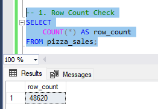
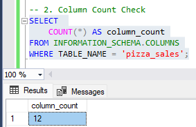
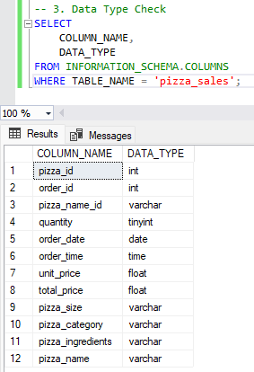

# PizzaSales

### Page 1: Business Overview

### Page 2: Sales Analysis


# Table of Contents
- [Objective](#objective)
- [Data Source](#data-source)
- [Stages](#stages)
  - [Mockup](#mockup)
  - [Tools](#tools)
  - [Development](#development)
  - [Pseudocode](#pseudocode)
  - [Data Exploration](#data-exploration)
  - [Data Cleaning](#data-cleaning)
- [Testing](#testing)
  - [Data Quality Checks](#data-quality-checks)
- [Visualisation](#visualisation)
  - [Results](#results)
  - [DAX Measures](#dax-measures)
- [Analysis](#analysis)
  - [Findings](#findings)
  - [Validation](#validation)
  - [Discovery](#discovery)
- [Conclusion](#conclusion) 

# Objective

* Key objectives for this project
The manager at this pizza shop wants to gain insights into how the business is performing, and he wants this information to be provided to him via an interactive dashboard. The dashboard should contain several key insights for the business, which will help him and his staff understand the data behind the business.

Ideal dashboard
The ideal dashboard should provide the relevant insights into the business, which includes key performance indicators such as;

  * The total revenue
  * Average Order value
  * Total pizzas sold
  * Total orders
  * Average pizzas per order
  
These KPIs will provide insightful information which the manager can use, furthermore, the dashboard should contain trends and insightful information, such as:

  * Total orders per day of the week
  * Total orders for hours of the day
  * Percentage of sales per pizza category
  * Percentage of sales per pizza size
  * Total sales per pizza
  * The top 5 best sellers by revenue
  * The bottom 5 sellers by total orders
  * The bottom 5 sellers by revenue
  * The bottom 5 sellers by total orders
  
The business can use this information to then make data driven decisions, such as, if it is worth continuing selling the bottom 5 popular pizzas.

# User story

As the manager of this pizza store, I want to identify key performance indicators and trends, such as the total revenue, total pizzas sold, the top 5 best sellers, the 5 lowest sellers, and several other insights. This is so I can make data driven decisions to help the business grow and generate more profit.

# Data Source

What data is needed to achieve the objectives?
* We need data on the pizza shop and their sales, such as
	* Pizza name
 	* Order date
  	* Quantity sold
  	* Total orders
  	* Total sales
  	* Pizza category
  	* Order time

# Stages

The stages for this project will be;
  * Design
  * Development
  * Testing
  * Analysis

# Stages

What should the dashboard contain?
To understand what the dashboard should contain, we need to figure out what questions we need the dashboard to answer, which will help provide the data to make data driven decisions. Some of the questions are as below:
* What day of the week has the highest number of orders?
* What hour of the day has the highest number of orders?
* Which category of pizza is the most popular?
* What are the top 5 pizzas by revenue?
* What are the bottom 5 pizzas by revenue?
* What are the top 5 pizzas by total orders?
* What are the bottom 5 pizzas by total orders?
* What is the percentage of sales per pizza category?
* What is the percentage of sales per pizza size?

## Tools

| Tool | Purpose |
| --- | --- |
| Excel | Exploring the data |
| SQL Server | Cleaning, testing, and analysing the data |
| Power BI | Visualising the data via interactive dashboards |
| GitHub | Hosting the project documentation and version control |

##Data Cleaning
  
  * What should the clean data look like?

The clean data should be structured and ready for analysis, and it should meet the following criteria and constraints:
 
1. Only relevant columns should be retained
2. All data types should be appropriate for the contents of each column
3. No NULL values in any of the columns
4. Correct data types for each column

Below is a table outlining the constraints on our cleaned data:

| Property | Description |
| --- | --- |
| Number of Rows | 48,620 |
| Number of Columns | 12 |

# Testing
Data quality and validation tests I conducted are as below:

## Row count check
### SQL Query
```sql
/*

-- 1. Row Count Check - Expected 46,620 (Passed)
SELECT
	COUNT(*) AS row_count
FROM pizza_sales;

```
### Output


## Column count check
### SQL Query
```sql
/*

-- 2. Column Count Check - Expected 12 (Passed)
SELECT 
	COUNT(*) AS column_count
FROM INFORMATION_SCHEMA.COLUMNS
WHERE TABLE_NAME = 'pizza_sales';

```
### Output


## Data type check
### SQL Query
```sql
/*

SELECT 
	COLUMN_NAME,
	DATA_TYPE
FROM INFORMATION_SCHEMA.COLUMNS
WHERE TABLE_NAME = 'pizza_sales';

```
### Output


# Visualisation

## Results
The dashboard looks as below:
### Page 1: Business Overview

### Page 2: Sales Analysis


# Dax Measures

### 1. Total Revnue ($)
```sql


```

### 2. Total Orders
```sql
Total Revenue ($) = ROUND(SUM(pizza_sales[total_price]), 2)

```

### 3. Total Pizzas Sold
```sql
Total Pizzas Sold = SUM(pizza_sales[quantity])

```

### 4. AVG Order Value ($)
```sql
AVG Order Value ($) = ROUND(DIVIDE(SUM(pizza_sales[total_price]),
			DISTINCTCOUNT(pizza_sales[order_id])), 2)

```

### 5. AVG Pizzas Sold
```sql
AVG Pizzas Sold Per Order = ROUND(DIVIDE(SUM(pizza_sales[quantity]),
			    DISTINCTCOUNT(pizza_sales[order_id])), 2)

```

### 6. Sales PCT Per Category
```sql
SalesPercentagePerCategory = 
DIVIDE(
    SUM(pizza_sales[total_price]),
    CALCULATE(SUM(pizza_sales[total_price]), ALL(pizza_sales[Pizza category]))
) * 100

```

### 6. Sales PCT Per Size
```sql
SalesPercentagePerSize = 
DIVIDE(
    SUM(pizza_sales[total_price]),
    CALCULATE(SUM(pizza_sales[total_price]), ALL(pizza_sales[Pizza size]))
) * 100

```
